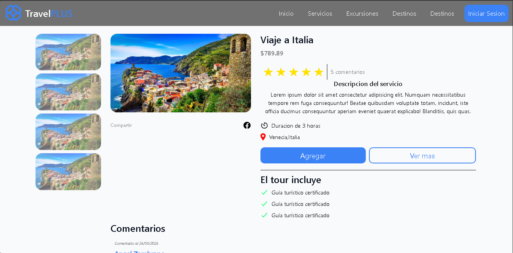

### Sistema de servicios turisticos
El sistema de servicios turisticos es un conjunto de actividades y servicios que se ofrecen a los
turistas para satisfacer sus necesidades y deseos durante su estancia en un destino turístico 
El sistema de servicios turisticos incluye:
- Alojamiento
- Transporte
- Actividades recreativas
- Guias turisticas
- Reseñas
- Reservas
- Excursiones

## Diseño de la web

